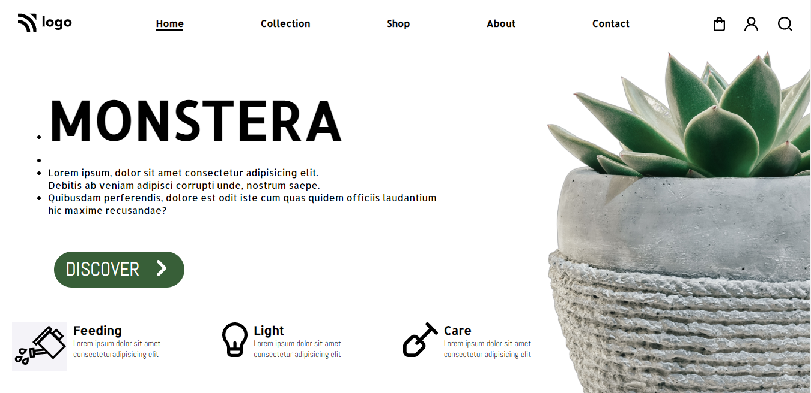

# Monstera | Project-6
#### by Ritam Mishra
### Tech That I use 
  

 

***

***
## What I learn from this project
- How to position any element.
- How to Design Button.
- Import icon from fontawesome.
- How to use SVG Image.

## Time to Complete
- It's takes near about 3 Hrs.